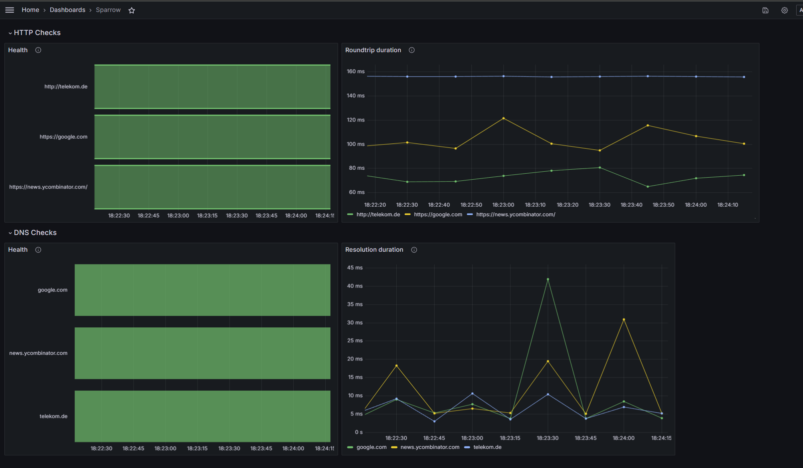

# Sparrow - Infrastructure Monitoring<!-- omit from toc -->

<!-- markdownlint-disable MD033 -->
<p align="center">
  <a href="/../../commits/" title="Last Commit"></a>
  <a href="/../../issues" title="Open Issues"></a>
  <a href="./LICENSE" title="License"></a>
</p>
<!-- markdownlint-enable MD033 -->

- [About this component](#about-this-component)
- [Installation](#installation)
  - [Binary](#binary)
  - [Container Image](#container-image)
  - [Helm](#helm)
- [Usage](#usage)
  - [Image](#image)
- [Configuration](#configuration)
  - [Startup](#startup)
    - [Example Startup Configuration](#example-startup-configuration)
    - [Loader](#loader)
    - [Logging Configuration](#logging-configuration)
  - [Checks](#checks)
  - [Target Manager](#target-manager)
  - [Check: Health](#check-health)
    - [Example configuration](#example-configuration)
    - [Health Metrics](#health-metrics)
  - [Check: Latency](#check-latency)
    - [Example configuration](#example-configuration-1)
    - [Latency Metrics](#latency-metrics)
  - [Check: DNS](#check-dns)
    - [Example configuration](#example-configuration-2)
    - [DNS Metrics](#dns-metrics)
  - [Check: Traceroute](#check-traceroute)
    - [Example configuration](#example-configuration-3)
    - [Optional Capabilities](#optional-capabilities)
    - [Traceroute Prometheus Metrics](#traceroute-prometheus-metrics)
    - [Traceroute API Metrics](#traceroute-api-metrics)
- [API](#api)
- [Metrics](#metrics)
  - [Prometheus Integration](#prometheus-integration)
  - [Traces](#traces)
- [Code of Conduct](#code-of-conduct)
- [Working Language](#working-language)
- [Support and Feedback](#support-and-feedback)
- [How to Contribute](#how-to-contribute)
- [Licensing](#licensing)

The `sparrow` is an infrastructure monitoring tool. The binary includes several checks (e.g. health check) that will be
executed periodically.

## About this component

The `sparrow` performs several checks to monitor the health of the infrastructure and network from its point of view.
The following checks are available:

1. [Health check](#check-health) - `health`: The `sparrow` is able to perform an HTTP-based (HTTP/1.1) health check to
   the provided endpoints. The `sparrow` will expose its own health check endpoint as well.

2. [Latency check](#check-latency) - `latency`: The `sparrow` is able to communicate with other `sparrow` instances to
   calculate the time a request takes to the target and back. The check is http (HTTP/1.1) based as well.

3. [DNS check](#check-dns) - `dns`: The `sparrow` is able to perform DNS resolution checks to monitor domain name system
   performance and reliability. The check has the ability to target specific domains or IPs for monitoring.

4. [Traceroute Check](#check-traceroute) - `traceroute`: The `sparrow` is able to perform traceroute checks to monitor
   the network path to a target. The check has the ability to target specific domains or IPs for monitoring.

Each check is designed to provide comprehensive insights into the various aspects of network and service health,
ensuring robust monitoring and quick detection of potential issues.

## Installation

The `sparrow` is provided as a small binary & a container image.

Please refer to the [release notes](https://github.com/caas-team/sparrow/releases) to get the latest version.

### Binary

The binary is available for several distributions. To install the binary, use a provided bundle or source.
Replace `${RELEASE_VERSION}` with the desired release version:

```sh
export RELEASE_VERSION=0.5.0
```

Download the binary:

```sh
curl https://github.com/caas-team/sparrow/releases/download/v${RELEASE_VERSION}/sparrow_${RELEASE_VERSION}_linux_amd64.tar.gz -Lo sparrow.tar.gz
curl https://github.com/caas-team/sparrow/releases/download/v${RELEASE_VERSION}/sparrow_${RELEASE_VERSION}_checksums.txt -Lo checksums.txt
```

Extract the binary:

```sh
tar -xf sparrow.tar.gz
```

### Container Image

The [sparrow container images](https://github.com/caas-team/sparrow/pkgs/container/sparrow) for
dedicated [release](https://github.com/caas-team/sparrow/releases) can be found in the GitHub registry.

### Helm

Sparrow can be installed via Helm Chart. The chart is available in the GitHub registry:

```sh
helm -n sparrow upgrade -i sparrow oci://ghcr.io/caas-team/charts/sparrow --create-namespace
```

The default settings are suitable for a local configuration. With the default Helm values, the sparrow loader uses a
checks' configuration provided in a ConfigMap (the `file` loader is used). Define the `checksConfig` section to set the
ConfigMap.

Use the following configuration values to use a runtime configuration by the `http` loader:

```yaml
startupConfig:
  ...
  loader:
    type: http
    interval: 30s
    http:
      url: https://url-to-checks-config.de/api/config%2Eyaml

checksConfig: { }
```

To provide the sparrow container with the token, manually create a secret containing the `SPARROW_LOADER_HTTP_TOKEN`
environment variable. Utilize the `envFromSecrets` in the `values.yaml` to enable access to this secret by the sparrow
container. Avoid adding sensitive data like the token used by the `http` loader (`loader.http.token`) directly in the
values section.

The same applies to the target manager token. Use the `SPARROW_TARGETMANAGER_GITLAB_TOKEN` in a secret and bind it with
the `envFromSecrets` in the `values.yaml`.

For all available value options see [Chart README](./chart/README.md).

Additionally check out the sparrow [configuration](#configuration) variants.

## Usage

Use `sparrow run` to execute the instance using the binary. A `sparrowName` (a valid DNS name) is required to be passed,
else the sparrow will not start:

```sh
sparrow run --sparrowName sparrow.telekom.de
```

### Image

Run a `sparrow` container by using e.g. `docker run ghcr.io/caas-team/sparrow`.

Pass the available configuration arguments to the container e.g. `docker run ghcr.io/caas-team/sparrow --help`.

Start the instance using a mounted startup configuration file
e.g. `docker run -v /config:/config  ghcr.io/caas-team/sparrow --config /config/config.yaml`.

## Configuration

The configuration is divided into two parts. The startup configuration and the checks' configuration. The startup
configuration is a technical configuration to configure the `sparrow` instance itself.

### Startup

The available configuration options can be found in the [CLI flag documentation](docs/sparrow.md).

The `sparrow` is able to get the startup configuration from different sources as follows.

Priority of configuration (high to low):

1. CLI flags
2. Environment variables
3. Defined configuration file
4. Default configuration file

Every value in the config file can be set through environment variables.

You can set a token for the http loader:

```bash
export SPARROW_LOADER_HTTP_TOKEN="xxxxxx"
```

Or for any other config attribute:

```bash
export SPARROW_ANY_OTHER_OPTION="Some value"
```

Just write out the path to the attribute, delimited by `_`.

#### Example Startup Configuration

```yaml
# DNS sparrow is exposed on 
name: sparrow.example.com

# Selects and configures a loader to continuously fetch the checks' configuration at runtime
loader:
  # Defines which loader to use. Options: "file | http"
  type: http
  # The interval in which sparrow tries to fetch a new configuration
  # If this isn't set or set to 0, the loader will only retrieve the configuration once
  interval: 30s
  # Config specific to the http loader
  http:
    # The URL where the config is located
    url: https://myconfig.example.com/config.yaml
    # This token is passed in the Authorization header when refreshing the config
    token: xxxxxxx
    # A timeout for the config refresh
    timeout: 30s
    retry:
      # How long to wait in between retries
      delay: 10s
      # How many times to retry
      count: 3

  # Config specific to the file loader
  # The file loader is not intended for production use
  file:
    # Location of the file in the local filesystem
    path: ./config.yaml

# Configures the API
api:
  # Which address to expose Sparrow's REST API on
  address: :8080
  # Configures tls for the http server
  # including prometheus metrics etc
  tls:
    # whether to enable tls, default is false
    enabled: true
    # path to your x509 certificate
    certPath: mycert.pem
    # path to your certificate key
    keyPath: mykey.key


# Configures the target manager.
targetManager:
  # whether to enable the target manager. (default: false)
  enabled: true
  # Defines which target manager to use.
  type: gitlab
  # The interval for the target reconciliation process
  checkInterval: 1m
  # How often the instance should register itself as a global target
  # A duration of 0 means no registration
  registrationInterval: 1m
  # How often the instance should update its registration as a global target
  # A duration of 0 means no update
  updateInterval: 120m
  # The amount of time a target can be unhealthy
  # before it is removed from the global target list
  # A duration of 0 means no removal
  unhealthyThreshold: 360m
  # Scheme defines with which scheme sparrow should register itself
  scheme: http
  # Configuration options for the GitLab target manager
  gitlab:
    # The URL of your GitLab host
    baseUrl: https://gitlab.com
    # Your GitLab API token
    # You can also set this value through the SPARROW_TARGETMANAGER_GITLAB_TOKEN environment variable
    token: glpat-xxxxxxxx
    # The ID of your GitLab project. This is where Sparrow will register itself
    # and grab the list of other Sparrows from
    projectId: 18923
    # The branch to use for the state file
    # If not set, it tries to resolve the default branch otherwise it uses the 'main' branch
    branch: main

# Configures the telemetry exporter.
telemetry:
  # Whether to enable telemetry. (default: false)
  enabled: true
  # The telemetry exporter to use.
  # Options:
  # grpc: Exports telemetry using OTLP via gRPC.
  # http: Exports telemetry using OTLP via HTTP.
  # stdout: Prints telemetry to stdout.
  # noop | "": Disables telemetry.
  exporter: grpc
  # The address to export telemetry to.
  url: localhost:4317
  # The token to use for authentication.
  # If the exporter does not require a token, this can be left empty.
  token: ""
  # Configures tls for the telemetry exporter
  tls:
    # Enable or disable TLS
    enabled: true
    # The path to the tls certificate to use.
    # Only required if your otel endpoint uses custom TLS certificates
    certPath: ""
```

#### Loader

The loader component of the `sparrow` dynamically loads the [checks](#checks)' configuration during runtime.

You select which loader is used by setting the `loaderType` parameter.

Available loaders:

- `http` (default): Retrieves the checks' configuration from a remote endpoint during runtime. Additional configuration
  parameters are set in the `loader.http` section.

- `file`: Loads the checks' configuration from a local file during runtime. Additional configuration
  parameters are set in the `loader.file` section.

If you want to retrieve the checks' configuration only once, you can set `loader.interval` to 0.
The target manager is currently not functional in combination with this configuration.

#### Logging Configuration

You can configure the logging behavior of the sparrow instance by setting the following environment variables:

- `LOG_LEVEL`: Adjusts the minimum log level.
  Available options: `DEBUG`, `INFO`, `WARNING`, `ERROR`.
- `LOG_FORMAT`: Sets the log format. This allows you to customize the format of the log messages.
  Available options: `JSON`, `TEXT`.

### Checks

In addition to the technical startup configuration, the `sparrow` checks' configuration can be dynamically loaded during runtime.
The `loader` is capable of dynamically loading and configuring checks.

For detailed information on available loader configuration options, please refer
to [this documentation](docs/sparrow_run.md).

Example format of a configuration file for the checks:

```YAML
health:
  targets: [ ]
```

### Target Manager

The `sparrow` can optionally manage targets for checks and register itself as a target on a (remote) backend through
the `TargetManager` interface. This feature is optional; if the startup configuration does not include
the `targetManager`, it will not be used. When configured, it offers various settings, detailed below, which can be set
in the startup YAML configuration file as shown in the [example configuration](#example-startup-configuration).

| Type                                 | Description                                                                                                                                     |
| ------------------------------------ | ----------------------------------------------------------------------------------------------------------------------------------------------- |
| `targetManager.enabled`              | Whether to enable the target manager. Defaults to false                                                                                         |
| `targetManager.type`                 | Type of the target manager. Options: `gitlab`                                                                                                   |
| `targetManager.scheme`               | Should the target register itself as http or https. Can be `http` or `https`. This needs to be set to `https`, when `api.tls.enabled` == `true` |
| `targetManager.checkInterval`        | Interval for checking new targets.                                                                                                              |
| `targetManager.unhealthyThreshold`   | Threshold for marking a target as unhealthy. 0 means no cleanup.                                                                                |
| `targetManager.registrationInterval` | Interval for registering the current sparrow at the target backend. 0 means no registration.                                                    |
| `targetManager.updateInterval`       | Interval for updating the registration of the current sparrow. 0 means no update.                                                               |
| `targetManager.gitlab.baseUrl`       | Base URL of the GitLab instance.                                                                                                                |
| `targetManager.gitlab.token`         | Token for authenticating with the GitLab instance.                                                                                              |
| `targetManager.gitlab.projectId`     | Project ID for the GitLab project used as a remote state backend.                                                                               |
| `targetManager.gitlab.branch`        | Branch to use for the state file. If not set, it tries to resolve the default branch otherwise it uses the `main` branch.                       |

Currently, only one target manager exists: the Gitlab target manager. It uses a gitlab project as the remote state
backend. The various `sparrow` instances can register themselves as targets in the project.
The `sparrow` instances will also check the project for new targets and add them to the local state.
The registration is done by committing a "state" file in the main branch of the repository,
which is named after the DNS name of the `sparrow`. The state file contains the following information:

```json
{
  "url": "<SCHEME>://<SPARROW_DNS_NAME>",
  "lastSeen": "2021-09-30T12:00:00Z"
}
```

### Check: Health

Available configuration options:

| Field         | Type              | Description                                                                                                                                                 |
| ------------- | ----------------- | ----------------------------------------------------------------------------------------------------------------------------------------------------------- |
| `interval`    | `duration`        | Interval to perform the health check.                                                                                                                       |
| `timeout`     | `duration`        | Timeout for the health check.                                                                                                                               |
| `retry.count` | `integer`         | Number of retries for the health check.                                                                                                                     |
| `retry.delay` | `duration`        | Initial delay between retries for the health check.                                                                                                         |
| `targets`     | `list of strings` | List of targets to send health probe. Needs to be a valid URL. Can be another `sparrow` instance. Automatically updated when a targetManager is configured. |

#### Example configuration

```yaml
health:
  interval: 10s
  timeout: 30s
  retry:
    count: 3
    delay: 1s
  targets:
    - https://example.com/
    - https://google.com/
```

#### Health Metrics

- `sparrow_health_up`
  - Type: Gauge
  - Description: Health of targets
  - Labelled with `target`

### Check: Latency

Available configuration options:

| Field         | Type              | Description                                                                                                                                                  |
| ------------- | ----------------- | ------------------------------------------------------------------------------------------------------------------------------------------------------------ |
| `interval`    | `duration`        | Interval to perform the latency check.                                                                                                                       |
| `timeout`     | `duration`        | Timeout for the latency check.                                                                                                                               |
| `retry.count` | `integer`         | Number of retries for the latency check.                                                                                                                     |
| `retry.delay` | `duration`        | Initial delay between retries for the latency check.                                                                                                         |
| `targets`     | `list of strings` | List of targets to send latency probe. Needs to be a valid URL. Can be another `sparrow` instance. Automatically updated when a targetManager is configured. |

<!-- markdownlint-disable MD024 -->
#### Example configuration
<!-- markdownlint-enable MD024 -->

```yaml
latency:
  interval: 10s
  timeout: 30s
  retry:
    count: 3
    delay: 1s
  targets:
    - https://example.com/
    - https://google.com/
```

#### Latency Metrics

- `sparrow_latency_duration_seconds`
  - Type: Gauge
  - Description: Latency with status information of targets. This metric is DEPRECATED. Use `sparrow_latency_seconds`.
  - Labelled with `target` and `status`

- `sparrow_latency_seconds`
  - Type: Gauge
  - Description: Latency information of targets
  - Labelled with `target`

- `sparrow_latency_count`
  - Type: Counter
  - Description: Count of latency checks done
  - Labelled with `target`

- `sparrow_latency_duration`
  - Type: Histogram
  - Description: Latency of targets in seconds
  - Labelled with `target`

### Check: DNS

Available configuration options:

| Field         | Type              | Description                                                                                                                                               |
| ------------- | ----------------- | --------------------------------------------------------------------------------------------------------------------------------------------------------- |
| `interval`    | `duration`        | Interval to perform the DNS check.                                                                                                                        |
| `timeout`     | `duration`        | Timeout for the DNS check.                                                                                                                                |
| `retry.count` | `integer`         | Number of retries for the DNS check.                                                                                                                      |
| `retry.delay` | `duration`        | Initial delay between retries for the DNS check.                                                                                                          |
| `targets`     | `list of strings` | List of targets to lookup. Needs to be a valid domain or IP. Can be another `sparrow` instance. Automatically updated when a targetManager is configured. |

<!-- markdownlint-disable MD024 -->
#### Example configuration
<!-- markdownlint-enable MD024 -->

```yaml
dns:
  interval: 10s
  timeout: 30s
  retry:
    count: 3
    delay: 1s
  targets:
    - www.example.com
    - www.google.com
```

#### DNS Metrics

- `sparrow_dns_status`
  - Type: Gauge
  - Description: Lookup status of targets
  - Labelled with `target`

- `sparrow_dns_check_count`
  - Type: Counter
  - Description: Count of DNS checks done
  - Labelled with `target`

- `sparrow_dns_duration_seconds`
  - Type: Gauge
  - Description: Duration of DNS resolution attempts
  - Labelled with `target`

- `sparrow_dns_duration`
  - Type: Histogram
  - Description: Histogram of response times for DNS checks
  - Labelled with `target`

### Check: Traceroute

| Field            | Type              | Description                                                                  |
| ---------------- | ----------------- | ---------------------------------------------------------------------------- |
| `interval`       | `duration`        | Interval to perform the Traceroute check.                                    |
| `timeout`        | `duration`        | Timeout for every hop.                                                       |
| `retry.count`    | `integer`         | Number of retries for the latency check.                                     |
| `retry.delay`    | `duration`        | Initial delay between retries for the latency check.                         |
| `maxHops`        | `integer`         | Maximum number of hops to try before giving up.                              |
| `targets`        | `list of objects` | List of targets to traceroute to.                                            |
| `targets[].addr` | `string`          | The address of the target to traceroute to. Can be an IP address or DNS name |
| `targets[].port` | `uint16`          | The port of the target to traceroute to. Default is 80                       |

<!-- markdownlint-disable MD024 -->
#### Example configuration
<!-- markdownlint-enable MD024 -->

```yaml
traceroute:
  interval: 5s
  timeout: 3s
  retry:
    count: 3
    delay: 1s
  maxHops: 30
  targets:
    - addr: 8.8.8.8
      port: 53
    - addr: www.google.com
      port: 80
```

#### Optional Capabilities

Sparrow does not need any extra permissions to run this check. However, some data, like the ip address
of the hop that dropped a packet, will not be available. To enable this functionality, there are two options:

- Run sparrow as root:

  ```bash
  sudo sparrow run --config config.yaml
  ```

- Allow sparrow to create raw sockets, by assigning the `CAP_NET_RAW` capability to the sparrow binary:

  ```bash
  sudo setcap 'cap_net_raw=ep' sparrow
  ```

#### Traceroute Prometheus Metrics

- `sparrow_traceroute_check_duration_ms{target="google.com"} 43150`
  - Type: Gauge
  - Description: How long the last traceroute took for this target in total
- `sparrow_traceroute_minimum_hops{target="google.com"} 14`
  - Type: Gauge
  - Description: The minimum number of hops required to reach a target

#### Traceroute API Metrics

The traceroute check exposes additional data through its rest API that isn't available in prometheus.
This data give a more detailed breakdown of the trace and can be found at `/v1/metrics/traceroute` and is
meant to be a json representation of traditional traceroute output:

```bash
$ traceroute -T -q 1 100.1.2.2
 1  200.2.0.1 (200.2.0.1)  2 ms
 2  11.0.0.34 (11.0.0.34)  5 ms
 ...
```

Is roughly equal to this:

```json
{
  "data": {
    "100.1.2.2": {
      "MinHops": 1,
      "Hops": {
        "1": [
          {
            "Latency": 2,
            "Addr": {
              "IP": "200.2.0.1",
              "Port": 80,
              "Zone": ""
            },
            "Name": "",
            "Ttl": 1,
            "Reached": false
          }
        ],
        "2": [
          {
            "Latency": 5,
            "Addr": {
              "IP": "11.0.0.34",
              "Port": 80,
              "Zone": ""
            },
            "Name": "",
            "Ttl": 2,
            "Reached": false
          }
        ]
        ...
      }
    },
  },
  "timestamp": "2024-07-26T15:49:39.60760766+02:00"
}

```

## API

The `sparrow` exposes an API for accessing the results of various checks. Each check registers its own endpoint
at `/v1/metrics/{check-name}`. The API's definition is available at `/openapi`.

## Metrics, Telemetry & Dashboards

The `sparrow` provides a `/metrics` endpoint to expose application metrics. In addition to runtime information, the sparrow provides specific metrics for each check. Refer to the [Checks](#checks) section for more detailed information.

### Prometheus Integration

The `sparrow` metrics API is designed to be compatible with Prometheus. To integrate `sparrow` with Prometheus, add the following scrape configuration to your Prometheus configuration file:

```yaml
scrape_configs:
  - job_name: 'sparrow'
    static_configs:
      - targets: ['<sparrow_instance_address>:8080']
```

Replace `<sparrow_instance_address>` with the actual address of your `sparrow` instance.

### Traces

The `sparrow` supports exporting telemetry data using the OpenTelemetry Protocol (OTLP). This allows users to choose their preferred telemetry provider and collector. The following configuration options are available for setting up telemetry:

| Field          | Type     | Description                                                                 |
| -------------- | -------- | --------------------------------------------------------------------------- |
| `enabled`      | `bool`   | Whether to enable telemetry. Default: `false`                               |
| `exporter`     | `string` | The telemetry exporter to use. Options: `grpc`, `http`, `stdout`, `noop`    |
| `url`          | `string` | The address to export telemetry to.                                         |
| `token`        | `string` | The token to use for authentication.                                        |
| `tls.enabled`  | `bool`   | Enable or disable TLS.                                                      |
| `tls.certPath` | `string` | The path to the TLS certificate to use. Only required if custom TLS is used |

For example, to export telemetry data using OTLP via gRPC, you can add the following configuration to your [startup configuration](#startup):

```yaml
telemetry:
  # Whether to enable telemetry. (default: false)
  enabled: true
  # The telemetry exporter to use.
  # Options:
  # grpc: Exports telemetry using OTLP via gRPC.
  # http: Exports telemetry using OTLP via HTTP.
  # stdout: Prints telemetry to stdout.
  # noop | "": Disables telemetry.
  exporter: grpc
  # The address to export telemetry to.
  url: collector.example.com:4317
  # The token to use for authentication.
  # If the exporter does not require a token, this can be left empty.
  token: ""
  tls:
    # Enable or disable TLS
    enabled: true
    # The path to the tls certificate to use.
    # Only required if your otel endpoint uses custom TLS certificates
    certPath: ""
```

Since [OTLP](https://opentelemetry.io/docs/specs/otlp/) is a standard protocol, you can choose any collector that supports it. The `stdout` exporter can be used for debugging purposes to print telemetry data to the console, while the `noop` exporter disables telemetry. If an external collector is used, a bearer token for authentication and a TLS certificate path for secure communication can be provided.

### Grafana Dashboards

A sample Grafana dashboard to visualize the metrics collected by the checks is available in the `examples` directory of the repository. How to import dashboards into Grafana is documented [here](https://grafana.com/docs/grafana/latest/reference/export_import/).



## Code of Conduct

This project has adopted the [Contributor Covenant](https://www.contributor-covenant.org/) in version 2.1 as our code of
conduct. Please see the details in our [CODE_OF_CONDUCT.md](CODE_OF_CONDUCT.md). All contributors must abide by the code
of conduct.

## Working Language

We decided to apply *English* as the primary project language.

Consequently, all content will be made available primarily in English.
We also ask all interested people to use English as the preferred language to create issues,
in their code (comments, documentation, etc.) and when you send requests to us.
The application itself and all end-user facing content will be made available in other languages as needed.

## Support and Feedback

The following channels are available for discussions, feedback, and support requests:

<!-- markdownlint-disable MD033 -->
| Type       | Channel                                                                                                                                                             |
| ---------- | ------------------------------------------------------------------------------------------------------------------------------------------------------------------- |
| **Issues** | <a href="/../../issues/new/choose" title="General Discussion"></a> |
<!-- markdownlint-enable MD033 -->

## How to Contribute

Contribution and feedback is encouraged and always welcome. For more information about how to contribute, the project
structure, as well as additional contribution information, see our [Contribution Guidelines](./CONTRIBUTING.md). By
participating in this project, you agree to abide by its [Code of Conduct](./CODE_OF_CONDUCT.md) at all times.

## Licensing

Copyright (c) 2023 Deutsche Telekom IT GmbH.

Licensed under the **Apache License, Version 2.0** (the "License"); you may not use this file except in compliance with
the License.

You may obtain a copy of the License at <https://www.apache.org/licenses/LICENSE-2.0>.

Unless required by applicable law or agreed to in writing, software distributed under the License is distributed on an "
AS IS" BASIS, WITHOUT WARRANTIES OR CONDITIONS OF ANY KIND, either express or implied. See the [LICENSE](./LICENSE) for
the specific language governing permissions and limitations under the License.
